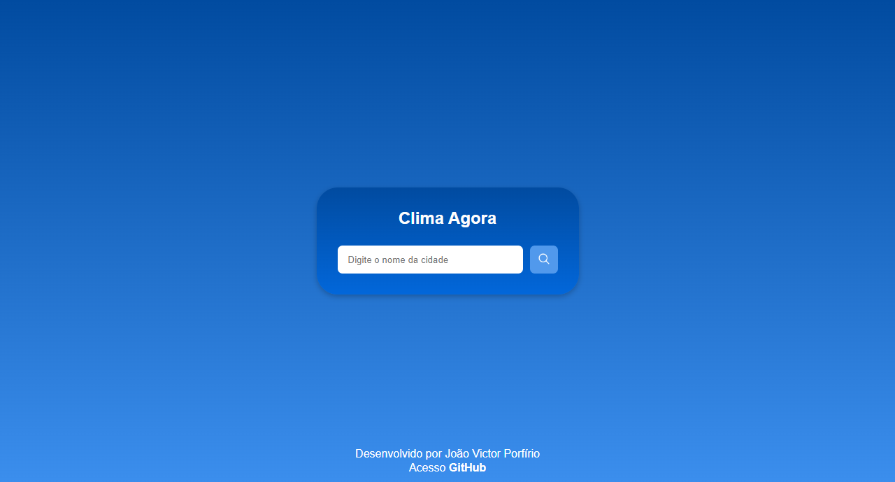
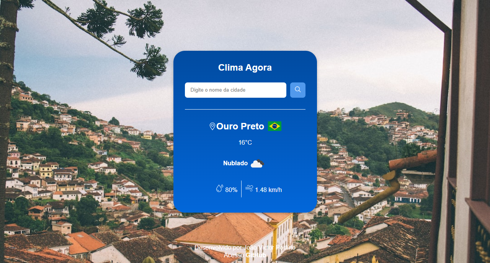

Readme

# Clima Agora

>Consumindo API de Clima - https://openweathermap.org/current
>Consumindo API do Unsplash - https://unsplash.com/documentation#get-a-random-photo

<!------------------------------------STACKS-->
#### Stacks:

 <a href="https://developer.mozilla.org/pt-BR/docs/Web/HTML"><a/>
   <a href="https://developer.mozilla.org/pt-BR/docs/Web/CSS"><a/>
    <a href="https://github.com/braziljs/eloquente-javascript"><a/>
   

  
  <!------------------------------------TOOLS-->
 #### Tools:
 <a href="https://code.visualstudio.com/"><a/>
  
  
  
   <!------------------------------------DESCRIPTION-->

#   Sobre o projeto <!---write here : talk a little about project: what's does, example.  -->
> O projeto Clima Agora tem a finalidade de fornecer informações do clima na cidade pesquisada. Os dados retornados são: cidade, bandeira do país, temperatura atual, descrição do tempo, umidade e velocidade do vento. 

> O Objetivo da criação deste projeto foi desenvolver uma aplicação que fosse necessária consumir uma API de clima e retornar dados da cidade pesquisada pelo usuário, além de utilizar métodos de assincronicidade como Async/await e utilização de promisses. Para complementar o projeto foi consumido uma segunda API do Unsplash que retorna uma imagem de Background relacionado com a cidade. 
  
>Link para acessar o projeto: https://joaovporfirio.github.io/climaAgora/
  
  
  # Conhecimentos utilizados

-HTML usado para desenvolvimento da estrutura.
 
-CSS para estilização e responsividade.
 
-JavaScript para consumumo da API de clima
 
-Responsividade para desktop e mobile.

# Feedback do projeto

Este projeto gerou alguns desafios como realizar a pesquisa quando o usuário apertasse a tecla enter e também a captação de alguns dos dados ao consumir a API. No fim todos os desafios foram solucionados proporcionando muito conhecimento.
